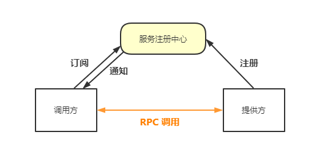
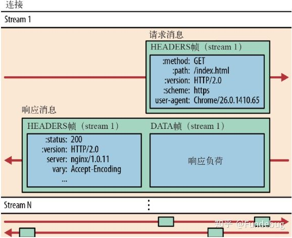

# RPC与gRPC

[[toc]]

## 1. 背景知识
### 1.1 RPC是啥
RPC (Remote Procedure Calls) 远程过程调用。本地调用远程方法，比较直接的做法是服务端暴露出 Restful 接口，客户端发 http request 去调用，RPC 的过程简单来看可以理解成是对这个操作进行的一层封装。
RPC 调用过程如下图所示，RPC 对服务调用方屏蔽掉网络请求、消息编码、数据传输等工作，提供一个代理对象给调用方，使服务调用方调用远程方法时如同调用本地方法一样简洁。


### 1.2 RPC 框架

RPC 抽象来看可以归纳为两方面问题： **1.调用方与提供方协议约定问题； 2.网络传输问题** ，解决这两块基本问题后，还得需要工程落地，解决服务发现、负载均衡、限流熔断等等问题，于是有了 RPC 框架的出现。


上图是一个典型的 RPC 框架的基本架构，主要分成四块：

> + 入口层：动态代理机制在服务提供方包装好服务的接口，暴露给调用方；对调用方提供代理对象，屏蔽其感知远程过程调用；
>
> + 集群层：解决分布式场景下的服务发现、节点负载均衡、容错、路由管理等等问题；
>
> + 协议层: 约定调用方与提供方数据包的格式，提供反序列化、解压缩等功能支持；
>
> + 网络传输: 提供 TCP 长链接传输、HTTP 通信等功能。

#### 1.2.1 服务治理（SOA）

服务治理解决什么问题？


+ 服务发现机制



类似 DNS 的机制，服务提供方向注册中心进行注册，调用方订阅服注册中心；注册中心拿到当前提供方服务的地址后推送给调用方。

### 1.3 RPC vs HTTP Service

相比于 HTTP 服务，RPC 具有以下优势：
+ 网络传输方面：基于 TCP 长链接，省去了 HTTP 连接建立过程中的性能损耗，提高传输效率；
+ 传输消息方面：传输的消息序列化成二进制对象，数据包体积减小，节省带宽；
+ 开发者友好：RPC 牺牲了消息的可读性来提高易用性，对于调用方开发者只需要调用本地接口即可调用远程方法；
+ 面向服务的封装：成熟的 RPC 框架封装了服务发现、负载均衡、熔断降级等等面向服务的高级特性，单纯使用 HTTP 服务调用则少了这些特性。

同时，也存在一些劣势：

+ 数据包可读性差，提高团队成员学习成本；
+ 交互性单一：只能调用方主动调用服务端方法，在需要服务端下发通知等场景下不适用。

如何选择 RPC 或 HTTP 服务？
1. 公司内部给其他业务提供接口时，优先考虑 RPC 服务，使用方为公司外部的服务，优先考虑 HTTP 服务；
2. 对于消耗特定资源的（例如 GPU/CPU/大内存资源），有特殊依赖的（比如运行环境需要依赖外部的 ffmpeg），集中实现效率比较高的（比如某个业务集中到几台机器，可以使用大内存缓存等）,选 RPC；
3. 一些经常变化的业务逻辑，依赖很广泛，又需要实现可以收敛且能随时更新，选择 RPC。

### 1.4 HTTP/2 协议

gRPC 框架的网络传输部分依赖 HTTP/2 协议，为理解 gRPC，先来了解一下 HTTP/2 协议。

##### 1.4.1 HTTP 发展历史

+ HTTP/1.0：链接无法复用，每次请求都需要经过三次握手，重新建立连接，增加延迟；
+ HTTP/1.1：Headers 中增加`keep-alive` 标识，可以复用一部分连接，但域名分片等情况下，仍需要建立多次连接，耗费资源；
+ HTTP/2.0：为提高传输性能，HTTP/2.0 在客户端和服务端之间只建立一个链接(connection)。

##### 1.4.2 HTTP/2.0 新特性

HTTP/2.0 协议 2015 年发布，完整的升级涉及到的内容较多，这里只挑部分特性了解一下。

+ 基本概念
> + 流：流是连接中的一个虚拟信道，可以承载双向的消息；每个流都有一个唯一的整数标识符；
>
> + 消息：是指逻辑上的 HTTP 消息，比如请求、响应等，由一或多个帧组成；
>
> + 帧：HTTP 2.0 通信的最小单位，每个帧包含帧首部，至少也会标识出当前帧所属的流，承载着特定类型的数据，如 HTTP 首部、负荷，等等

+ 二进制传输消息

HTTP/1.x 的请求包和响应包，都是由起始行、Headers 和 Body 组成，各部分之间以文本换行符分隔，而 **HTTP/2 将请求和响应数据分割为更小的帧，并且采用二进制编码** 。

+ 多路复用

针对同一域名只建立一个链接(Connection)，该信道可承载任意数量的双向数据流(Stream)，每个数据流中以消息(Message)的形式读写，一个消息的最小组成单位为帧(Frame)，数据流内的消息可以乱序发送，根据帧头部的流标识可以重排。



+ Header 压缩

在 HTTP/1 中，我们使用文本的形式传输 header，在 header 携带 cookie 的情况下，可能每次都需要重复传输几百到几千的字节。

为了减少这块的资源消耗并提升性能， HTTP/2对这些首部采取了压缩策略：

> + HTTP/2在客户端和服务器端使用“首部表”来跟踪和存储之前发送的键－值对，对于相同的数据，不再通过每次请求和响应发送；
>
> + 首部表在HTTP/2的连接存续期内始终存在，由客户端和服务器共同渐进地更新;
> 
> + 每个新的首部键－值对要么被追加到当前表的末尾，要么替换表中之前的值。

例如下图中的两个请求， 请求一发送了所有的头部字段，第二个请求则只需要发送差异数据，这样可以减少冗余数据，降低开销。


## 2. gRPC
### 2.1 gRPC 特性
+ 优势
> + 支持多种语言；
>
> + 基于 IDL 文件定义服务，通过 proto3 工具生成指定语言的数据结构、服务端接口以及客户端 Stub；
>
> + 网络通信依赖 Netty 实现的 HTTP/2 协议封装，支持双向流、消息头压缩、单 TCP 的多路复用、服务端推送等特性，这些特性使得 gRPC 在移动端设备上更加省电和节省网络流量；
>
> + 序列化支持 PB（Protocol Buffer）和 JSON，PB 是一种语言无关的高性能序列化框架，基于 HTTP/2 + PB, 保障了 RPC 调用的高性能。

+ 劣势
> + 服务治理相关能力缺失，负载均衡和服务发现等功能需要开发者扩展实现。

### 2.2 gRPC 核心概念
##### 2.2.1 服务调用模式

gRPC 底层通信依赖于 HTTP/2 协议，由于 HTTP/2 协议是一个支持双向流的协议，因此 gRPC 在 API 的设计上也才用了流的方式。gRPC 中允许定义四种服务调用模式：

1. Unary 调用模式：响应-请求模式，客户端发送请求给服务端，服务端应答；
::: tip 示例
   rpc SayHello(HelloRequest) returns (HelloResponse){ }
:::

2. Server Streaming 模式：客户端发送一个请求给服务端，并获取一个数据流用来读取一系列消息。客户端从返回的数据流里一直读取直到没有更多消息为止；
::: tip 示例
rpc LotsOfReplies(HelloRequest) returns (stream HelloResponse){ }
:::

3. Client Streaming 模式：客户端用提供的一个数据流写入并发送一系列消息给服务端。一旦客户端完成消息写入，就等待服务端读取这些消息并返回应答；
::: tip 示例
rpc LotsOfGreetings(stream HelloRequest) returns (HelloResponse) { }
:::

4. 双向 Streaming 模式：通信双方之间建立相互独立的读写数据流来发送一系列消息，双方都可发送多次消息，且允许乱序发送消息。
::: tip 示例
rpc BidiHello(stream HelloRequest) returns (stream HelloResponse){ }
:::

##### 2.2.2 Protobuf

gRPC 默认使用 Protocol Buffers (Protobuf) 作为接口定义语言，来描述服务接口和消息结构。Protocol Buffers 是一个可独立使用的序列化框架，它并不与 gRPC 框架绑定，任何需要支持多语言的 RPC 框架都可以选择使用 Protocol Buffers 作为序列化框架。

Protocol Buffers 的使用主要包括:

> + IDL 文件定义（*.proto）, 包含数据结构定义，以及可选的服务接口定义（gRPC）；
> 
> + 各种语言的代码生成（含数据结构定义、以及序列化和反序列化接口）；
> 
> + 使用 Protocol Buffers 的 API 进行序列化和反序列化。

**0x1 支持的数据结构**
+ 支持主流语言常用数据结构，考虑到跨语言特性，对于特定语言的数据结构并不提供支持，如 Java 的 Exception 对象。

**0x2 基本数据类型**
| protobuf |    C++    |    Java    |
|:--------:|:---------:|:----------:|
|  double  |  double   |   double   |
|  float   |   float   |   float    |
|  int32   |   int32   |    int     |
|  int64   |   int64   |    long    |
|  string  |  string   |  	String   |
|  bytes   |  string   | ByteString |
|  bool    |   bool    |  boolean   |
|   … 	    |    … 	    |     …      |

**0x3 复杂数据类型**

+ 数组类型

利用 Protobuf 提供的 repeted关键字，标识该字段重复任意次数，相当于数组的功能。

+ 枚举类型

enum关键字定义枚举类型，eg.
```java
message QueryInfo{
	string queryID = 1;
	enum Types{
		USER = 0;
		GROUP=1;
		OTHERS=2;
	}
	Types type = 2;
}
```
+ Map 类型

在 Protobuf 3 中新增了对 Map 类型的支持，eg.
```java
map<key_type, value_type> map_field = N;
message ValueType{...}
map<string, ValueType> typeMap = 0;
```
+ 泛型

对于类型无法确定的情况，类似于 Java 中的泛型，Protobuf 提供了`google.protobuf.Any`这个类型，表示存放任意类型的数据。根据我司开发规范，这种类型被强制不允许使用。

详细语法参考：[Language Guide (proto3)](https://developers.google.com/protocol-buffers/docs/proto3)

**0x4 代码生成**

.proto 文件中定义的每个 service ，protoc 会生成一个名为`{service_name}Grpc`的类，这个类存放在`java_packag`指定的包结构下。

下载 protoc 后，可以通过命令行调用 protoc 来生成桩代码，或者使用官方推荐的更优雅的方式，配置 maven 或者 gradle 在项目编译时自动生成桩代码。maven 配置见下文。

## 3. Hello gRPC
以下参考 gRPC 官方文档的 demo 学习 gRPC 基本用法，实现服务端(Java)与客户端(Java)之间四种服务调用模式通信。

### 3.1 服务端
##### 3.1.1 开发环境配置
1. 下载 protoc 编译器，配置环境变量，安装一个支持 proto 语法高亮的 IDEA 插件；

2. 新建 maven 项目，配置 pom.xml 添加对 Protobuf 的依赖：
::: details 点我查看代码
```xml
<dependencies>
    <dependency>
        <groupId>io.grpc</groupId>
        <artifactId>grpc-netty</artifactId>
        <version>${grpc.version}</version>
    </dependency>
    <dependency>
        <groupId>io.grpc</groupId>
        <artifactId>grpc-protobuf</artifactId>
        <version>${grpc.version}</version>
    </dependency>
    <dependency>
        <groupId>io.grpc</groupId>
        <artifactId>grpc-stub</artifactId>
        <version>${grpc.version}</version>
    </dependency>
    <dependency>
        <groupId>com.google.protobuf</groupId>
        <artifactId>protobuf-java</artifactId>
        <version>${protobuf.version}</version>
    </dependency>
    <dependency>
        <groupId>io.grpc</groupId>
        <artifactId>grpc-all</artifactId>
        <version>0.13.2</version>
    </dependency>
</dependencies>
```
:::

3. 建立源码目录

手动建立目录`src/main/java`保存服务实现源码，`src/main/proto`保存.proto 文件，注意这里要把 /proto 这个目录设置成源文件目录(Mark Directory as -> Sources Root)。

##### 3.1.2 服务定义
在/proto 目录下，新建`test.proto`文件，定义四个 RPC 方法，分别对应四种服务类型，以及`request`和`response`的类型：

::: details 点我查看代码
```proto
syntax = "proto3";    // 指定语法为 proto3 格式
option java_package = "me.misscoconut.rpc";  // 生成 Java 类文件所在包名
option java_outer_classname = "GetProfile";  // 生成的 Java 类名
option java_multiple_files = true;  // 针对每个 message 和 ervice 都单独生成一个类；设置为 false,会以内部类的形式生成

service GetProfileService{
  rpc getUsernameByID(ProfileRequest) returns (ProfileResponse);                  // Simple RPC
  rpc getUsernamesByID(ProfileRequest) returns (stream ProfileResponse);          // Server Streaming
  rpc getUsernameByIDs(stream ProfileRequest) returns (ProfileResponse);          // Client Streaming
  rpc getUsernamesByIDs(stream ProfileRequest) returns (stream ProfileResponse);  // Bidirectional Streaming
}

message ProfileRequest{
  string userID = 1;
}

message ProfileResponse{
  string userName = 1;
}

message ProfileResponseList{
  repeated ProfileResponse response = 1;
}
```
::: details 点我查看代码
##### 3.1.3 生成Java桩代码
在 pom.xml 配置 protobuf 插件:

::: details 点我查看代码
```xml
<build>
       <extensions>
           <extension>
               <groupId>kr.motd.maven</groupId>
               <artifactId>os-maven-plugin</artifactId>
               <version>1.4.1.Final</version>
           </extension>
       </extensions>
       <plugins>
           <plugin>
               <groupId>org.xolstice.maven.plugins</groupId>
               <artifactId>protobuf-maven-plugin</artifactId>
               <version>0.5.0</version>
               <configuration>
                   <protocArtifact>com.google.protobuf:protoc:3.3.0:exe:${os.detected.classifier}
                   </protocArtifact>
                   <pluginId>grpc-java</pluginId>
                   <pluginArtifact>
                       io.grpc:protoc-gen-grpc-java:1.4.0:exe:${os.detected.classifier}
                   </pluginArtifact>
               </configuration>
               <executions>
                   <execution>
                       <goals>
                           <goal>compile</goal>
                           <goal>compile-custom</goal>
                       </goals>
                   </execution>
               </executions>
           </plugin>
       </plugins>
   </build>
```
:::

同步一下，maven compile 项目。/target/generated-sources 下生成的 java 桩代码，复制到 /src/main/java 下。

##### 3.1.4服务端实现
服务接口实现类继承自`GetProfileServiceImplBase`，重写基类里边的各服务方法。

+ 服务端创建:
::: details 点我查看代码
```java
private void start() throws IOException {
        // 指定 grpc 服务器端口，绑定服务接口实现，启动 grpc server
        int port = 23333;
        grpcServer = ServerBuilder.forPort(port)
                .addService(new GetProfileServiceImpl())
                .build()
                .start();

        System.out.println("GetProfileRpcServer.start,listing on port " + port);

        // 添加 hook，jvm 退出前关闭 tcp 连接
        Runtime.getRuntime().addShutdownHook(new Thread() {
            @Override
            public void run() {
                System.out.println("Shutting down GetProfileRpcServer since JVM is shutting down.");
                GetProfileRpcServer.this.stop();
            }
        });
    }
```
:::

+ 服务接口实现
::: details 点我查看代码
```java
private static class GetProfileServiceImpl extends GetProfileServiceGrpc.GetProfileServiceImplBase {
       // Simple RPC
       @Override
       public void getUsernameByID(ProfileRequest request, StreamObserver<ProfileResponse> responseObserver) {
           responseObserver.onNext(
                   ProfileResponse.newBuilder().setUserName("simple rpc response.").build());
           responseObserver.onCompleted();
       }

       // Server Streaming
       @Override
       public void getUsernamesByID(ProfileRequest request, StreamObserver<ProfileResponse> responseObserver) {
           List<ProfileResponse> responseList = new ArrayList<>();
           responseList.add(ProfileResponse.newBuilder().setUserName("server streaming rpc response 1.").build());
           responseList.add(ProfileResponse.newBuilder().setUserName("server streaming rpc response 2.").build());
           responseList.add(ProfileResponse.newBuilder().setUserName("server streaming rpc response 3.").build());
           responseList.add(ProfileResponse.newBuilder().setUserName("server streaming rpc response 3.").build());

           for (ProfileResponse resp : responseList) {
               responseObserver.onNext(resp);
           }

           responseObserver.onCompleted();
       }

       // Client Streaming
       @Override
       public StreamObserver<ProfileRequest> getUsernameByIDs(StreamObserver<ProfileResponse> responseObserver) {
           List<String> reqFromClient = new ArrayList<>();
           return new StreamObserver<ProfileRequest>() {
               @Override
               public void onNext(ProfileRequest profileRequest) {
                   reqFromClient.add(profileRequest.getUserID());
               }

               @Override
               public void onError(Throwable throwable) {
                   System.out.println("GetProfileServiceImpl.onError");
               }

               @Override
               public void onCompleted() {
                   for (String req : reqFromClient) {
                       System.out.println("Client streaming request " + req);
                   }
                   responseObserver.onNext(ProfileResponse.newBuilder().setUserName("Client streaming response.").build());
                   responseObserver.onCompleted();
               }
           };
       }

       // Bidirectional Streaming
       @Override
       public StreamObserver<ProfileRequest> getUsernamesByIDs(StreamObserver<ProfileResponse> responseObserver) {
           return new StreamObserver<ProfileRequest>() {
               @Override
               public void onNext(ProfileRequest profileRequest) {
                   responseObserver.onNext(ProfileResponse.newBuilder().setUserName("Bidirectional Streaming Server response.").build());
               }

               @Override
               public void onError(Throwable throwable) {
                   System.out.println("GetProfileServiceImpl.onError");
               }

               @Override
               public void onCompleted() {
                   responseObserver.onCompleted();
               }
           };
       }
   }
```
:::

### 3.2 服务端创建流程
服务端创建过程主要涉及`ServerBuilder、NettyServerProvider、GetProfileServiceImpl`三个对象。

大致流程：

1. 创建 Netty HTTP/2 服务端，监听指定的 Socket 地址；

2. 绑定 proto 文件中定义的服务接口实现类，将需要调用的服务端接口实现类注册到内部的注册中心；

>由于注册中心机制，gRPC 服务接口实现类的调用不需要通过动态代理和反射机制，而是通过 proto 工具生成代码，在服务端启动时，将服务接口实现类实例注册到 gRPC 内部的服务注册中心上。请求消息接入之后，可以根据服务名和方法名，直接调用启动时注册的服务实例，而不需要通过反射的方式进行调用，性能更高。

3. 创建 gRPC Server，用于 RPC 消息的统一调度和处理。

### 3.3 客户端
##### 3.3.1 请求流程
1. 指定 ip:port 创建`ManagedChannelImpl`;
2. 创建客户端 Stub；
3. 使用客户端 Stub 发起 RPC 请求获得响应。

##### 3.3.2 主要代码
::: details 点我查看代码
```java
public static void main(String[] args) {
    ManagedChannel channel = ManagedChannelBuilder.forTarget("localhost:23333")
            .usePlaintext(true)
            .build();

    GetProfileServiceGrpc.GetProfileServiceBlockingStub blockingStub = GetProfileServiceGrpc.newBlockingStub(channel);

    // Unary
    GetProfileServiceGrpc.GetProfileServiceStub stub = GetProfileServiceGrpc.newStub(channel);
    ProfileResponse response = blockingStub
            .getUsernameByID(ProfileRequest.newBuilder().setUserID("cocotest").build());

    System.out.println(response.getUserName());

    // Client Streaming
    Iterator<ProfileResponse> results =
      blockingStub.getUsernamesByID(ProfileRequest.newBuilder().setUserID("cocotest").build());
    while (results.hasNext()) {
        System.out.println(results.next().getUserName());
    }

    // Server Streaming
    // 1. response
    StreamObserver<ProfileResponse> responseStreamObserver = new StreamObserver<ProfileResponse>() {
        @Override
        public void onNext(ProfileResponse profileResponse) {
            System.out.println("[Server Streaming] Client received :" + profileResponse.getUserName());
        }
        @Override
        public void onError(Throwable throwable) {
            System.out.println(throwable.getMessage());
        }
        @Override
        public void onCompleted() {
            System.out.println("[Server Streaming] Client.onCompleted()");
        }
    };
    // 2. request
    StreamObserver<ProfileRequest> usernameByIDs = stub.getUsernameByIDs(responseStreamObserver);
    usernameByIDs.onNext(ProfileRequest.newBuilder().setUserID("ccc1111").build());
    usernameByIDs.onNext(ProfileRequest.newBuilder().setUserID("ccc2222").build());
    usernameByIDs.onNext(ProfileRequest.newBuilder().setUserID("ccc3333").build());
    usernameByIDs.onCompleted();
    try {
        Thread.sleep(2000);
    } catch (
            InterruptedException e) {
        e.printStackTrace();
    }

    // Bidirectional Streaming
    StreamObserver<ProfileResponse> responseStreamObserver2 = new StreamObserver<ProfileResponse>() {
        @Override
        public void onNext(ProfileResponse value) {
            System.out.println("[Bidirectional] Client received :" + value.getUserName());
        }

        @Override
        public void onError(Throwable t) {
            System.out.println(t.getMessage());
        }

        @Override
        public void onCompleted() {
            System.out.println("[Bidirectional] Client.onCompleted()");
        }
    };
    StreamObserver<ProfileRequest> usernamesByIDs = stub.getUsernamesByIDs(responseStreamObserver2);
    for (int i = 0; i < 10; i++) {
        usernamesByIDs.onNext(ProfileRequest.newBuilder().setUserID("c:" + i).build());
        System.out.println("c:" + i);
        try {
            Thread.sleep(500);
        } catch (InterruptedException e) {
            e.printStackTrace();
        }
    }
    usernamesByIDs.onCompleted();
    try {
        Thread.sleep(30000);
    } catch (InterruptedException e) {
        e.printStackTrace();
    }
    channel.shutdown();
}
```
:::
### 3.4 客户端调用流程

>1.客户端 Stub(GetProfileServiceBlockingStub) 调用 getUsernameByID(request)，发起 RPC 调用；
>
>2.通过 DnsNameResolver进行域名解析，获取服务端的地址信息（列表），随后使用默认的 LoadBalancer策略，选择一个具体的 gRPC 服务端实例；
>
>3.如果与路由选中的服务端之间没有可用的连接，则创建 NettyClientTransport 和 NettyClientHandler，发起 HTTP/2 连接；对请求消息使用 Protobuf 做序列化，通过 HTTP/2 Stream 发送给 gRPC 服务端；
>
>4.接收到服务端响应之后，使用 Protobuf 做反序列化；
>
>5.回调 GrpcFuture 的 set(Response) 方法，唤醒阻塞的客户端调用线程，获取 RPC 响应。

## 4. 问题
### 4.1 找不到类`io.grpc.BindableService`
```java
java.lang.NoClassDefFoundError: io/grpc/BindableService
	at java.lang.Class.getDeclaredMethods0(Native Method)
	at java.lang.Class.privateGetDeclaredMethods(Class.java:2701)
	at java.lang.Class.privateGetMethodRecursive(Class.java:3048)
	at java.lang.Class.getMethod0(Class.java:3018)
	at java.lang.Class.getMethod(Class.java:1784)
	at sun.launcher.LauncherHelper.validateMainClass(LauncherHelper.java:544)
	at sun.launcher.LauncherHelper.checkAndLoadMain(LauncherHelper.java:526)
Caused by: java.lang.ClassNotFoundException: io.grpc.BindableService
	at java.net.URLClassLoader.findClass(URLClassLoader.java:381)
	at java.lang.ClassLoader.loadClass(ClassLoader.java:424)
	at sun.misc.Launcher$AppClassLoader.loadClass(Launcher.java:349)
	at java.lang.ClassLoader.loadClass(ClassLoader.java:357)
	... 7 more
Error: A JNI error has occurred, please check your installation and try again
Exception in thread "main" 
Process finished with exit code 1
```
::: warning Tips
原因：
<br/>jdk 版本和 jre 版本不一致引起该问题。

解决：
<br/>检查 **java -version** 和 **javac -version** 版本是否一致。
:::


重新安装一致的版本。

## 5. 参考链接
[gRPC系列(三) 如何借助HTTP2实现传输](https://zhuanlan.zhihu.com/p/161577635)
<br/>[深入理解Protobuf3协议原理](https://juejin.cn/post/6844904007811465229)

>本文作者：[许怀安](https://dbsecurity.com.cn/)
><br/>创作时间：2022.1.10
><br/>版权声明：本博客所有文章除特别声明外，均采用[BY-NC-SA](https://creativecommons.org/licenses/by-nc-sa/4.0/deed.zh)许可协议。转载请禀明出处！