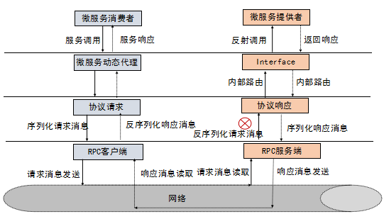
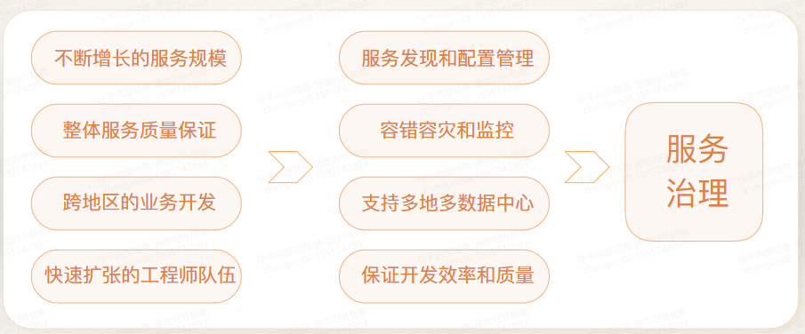
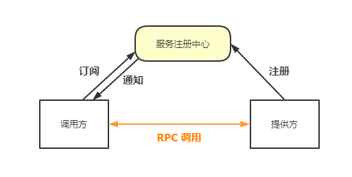
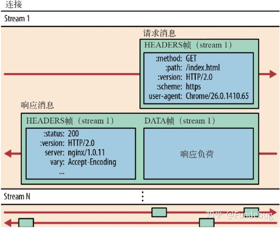
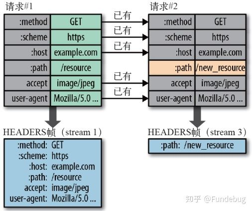

# 一、背景知识
## 1.1 RPC是啥
&ensp;&ensp;&ensp;&ensp;RPC (Remote Procedure Calls) 远程过程调用。本地调用远程方法，比较直接的做法是服务端暴露出 Restful 接口，客户端发 http request 去调用，RPC 的过程简单来看可以理解成是对这个操作进行的一层封装。
RPC 调用过程如下图所示，RPC 对服务调用方屏蔽掉网络请求、消息编码、数据传输等工作，提供一个代理对象给调用方，使服务调用方调用远程方法时如同调用本地方法一样简洁。

## 1.2 RPC 框架

&ensp;&ensp;&ensp;&ensp;RPC 抽象来看可以归纳为两方面问题： **1.调用方与提供方协议约定问题； 2.网络传输问题** ，解决这两块基本问题后，还得需要工程落地，解决服务发现、负载均衡、限流熔断等等问题，于是有了 RPC 框架的出现。

上图是一个典型的 RPC 框架的基本架构，主要分成四块：

> + 入口层：动态代理机制在服务提供方包装好服务的接口，暴露给调用方；对调用方提供代理对象，屏蔽其感知远程过程调用；
>
> + 集群层：解决分布式场景下的服务发现、节点负载均衡、容错、路由管理等等问题；
>
> + 协议层: 约定调用方与提供方数据包的格式，提供反序列化、解压缩等功能支持；
>
> + 网络传输: 提供 TCP 长链接传输、HTTP 通信等功能。

### 1.2.1 服务治理（SOA）

服务治理解决什么问题？

+ 服务发现机制

类似 DNS 的机制，服务提供方向注册中心进行注册，调用方订阅服注册中心；注册中心拿到当前提供方服务的地址后推送给调用方。

## 1.3 RPC vs HTTP Service

相比于 HTTP 服务，RPC 具有以下优势：
+ 网络传输方面：基于 TCP 长链接，省去了 HTTP 连接建立过程中的性能损耗，提高传输效率；
+ 传输消息方面：传输的消息序列化成二进制对象，数据包体积减小，节省带宽；
+ 开发者友好：RPC 牺牲了消息的可读性来提高易用性，对于调用方开发者只需要调用本地接口即可调用远程方法；
+ 面向服务的封装：成熟的 RPC 框架封装了服务发现、负载均衡、熔断降级等等面向服务的高级特性，单纯使用 HTTP 服务调用则少了这些特性。

同时，也存在一些劣势：

+ 数据包可读性差，提高团队成员学习成本；
+ 交互性单一：只能调用方主动调用服务端方法，在需要服务端下发通知等场景下不适用。

如何选择 RPC 或 HTTP 服务？
1. 公司内部给其他业务提供接口时，优先考虑 RPC 服务，使用方为公司外部的服务，优先考虑 HTTP 服务；
2. 对于消耗特定资源的（例如 GPU/CPU/大内存资源），有特殊依赖的（比如运行环境需要依赖外部的 ffmpeg），集中实现效率比较高的（比如某个业务集中到几台机器，可以使用大内存缓存等）,选 RPC；
3. 一些经常变化的业务逻辑，依赖很广泛，又需要实现可以收敛且能随时更新，选择 RPC。

## 1.4 HTTP/2 协议

gRPC 框架的网络传输部分依赖 HTTP/2 协议，为理解 gRPC，先来了解一下 HTTP/2 协议。

### 1.4.1 HTTP 发展历史

+ HTTP/1.0：链接无法复用，每次请求都需要经过三次握手，重新建立连接，增加延迟；
+ HTTP/1.1：Headers 中增加`keep-alive` 标识，可以复用一部分连接，但域名分片等情况下，仍需要建立多次连接，耗费资源；
+ HTTP/2.0：为提高传输性能，HTTP/2.0 在客户端和服务端之间只建立一个链接(connection)。

### 1.4.2 HTTP/2.0 新特性

HTTP/2.0 协议 2015 年发布，完整的升级涉及到的内容较多，这里只挑部分特性了解一下。

+ 基本概念
> + 流：流是连接中的一个虚拟信道，可以承载双向的消息；每个流都有一个唯一的整数标识符；
>
> + 消息：是指逻辑上的 HTTP 消息，比如请求、响应等，由一或多个帧组成；
>
> + 帧：HTTP 2.0 通信的最小单位，每个帧包含帧首部，至少也会标识出当前帧所属的流，承载着特定类型的数据，如 HTTP 首部、负荷，等等

+ 二进制传输消息

HTTP/1.x 的请求包和响应包，都是由起始行、Headers 和 Body 组成，各部分之间以文本换行符分隔，而 **HTTP/2 将请求和响应数据分割为更小的帧，并且采用二进制编码** 。

+ 多路复用

针对同一域名只建立一个链接(Connection)，该信道可承载任意数量的双向数据流(Stream)，每个数据流中以消息(Message)的形式读写，一个消息的最小组成单位为帧(Frame)，数据流内的消息可以乱序发送，根据帧头部的流标识可以重排。

+ Header 压缩

在 HTTP/1 中，我们使用文本的形式传输 header，在 header 携带 cookie 的情况下，可能每次都需要重复传输几百到几千的字节。

为了减少这块的资源消耗并提升性能， HTTP/2对这些首部采取了压缩策略：

> + HTTP/2在客户端和服务器端使用“首部表”来跟踪和存储之前发送的键－值对，对于相同的数据，不再通过每次请求和响应发送；
>
> + 首部表在HTTP/2的连接存续期内始终存在，由客户端和服务器共同渐进地更新;
> 
> + 每个新的首部键－值对要么被追加到当前表的末尾，要么替换表中之前的值。

例如下图中的两个请求， 请求一发送了所有的头部字段，第二个请求则只需要发送差异数据，这样可以减少冗余数据，降低开销。

## 参考链接
[gRPC系列(三) 如何借助HTTP2实现传输](https://zhuanlan.zhihu.com/p/161577635)
 [深入理解Protobuf3协议原理](https://juejin.cn/post/6844904007811465229)

>本文作者：[许怀安](http://linux-ln.com)
> 创作时间：2022.1.10
> 版权声明：本博客所有文章除特别声明外，均采用[BY-NC-SA](https://creativecommons.org/licenses/by-nc-sa/4.0/zh-CN/)许可协议。转载请禀明出处！
