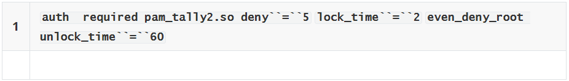

# centos基线加固

[[toc]]

::: tip Tips
本文从Centos 7.x系列系统的16个角度来加固主机的安全性，不足之处，敬请谅解。
:::

## 一、密码长度与有效期
### 1.1 默认配置
```shell
cat /etc/login.defs |grep PASS_ |grep -v '#'
```
> + PASS_MAX_DAYS 99999
> + PASS_MIN_DAYS 0
> + PASS_MIN_LEN 5
> + PASS_WARN_AGE 7

### 1.2 加固方案：

#### 1.2.1 备份配置文件
```shell
cp -a /etc/login.defs /etc/login.defs.default
```

#### 1.2.2 编辑配置文件并将相关参数改成如下
```shell
vim /etc/login.defs
```

> + PASS_MAX_DAYS 90
> + PASS_MIN_DAYS 6
> + PASS_MIN_LEN 8
> + PASS_WARN_AGE 30

::: tip 备注
/etc/login.defs文件的pass_min_len 参数并不具备强制性，测试仍然可以设置7位密码。最终需要cracklib来实现。
:::

#### 1.2.3 参数说明:

> + PASS_MAX_DAYS 密码有效期
> + PASS_MIN_DAYS 修改密码的最短期限
> + PASS_MIN_LEN 密码最短长度
> + PASS_WARN_AGE 密码过期提醒

## 二、密码复杂度

### 2.1 默认配置
```shell
cat /etc/pam.d/system-auth | grep "pam_pwquality.so try_first_pass local_users_only retry=3 authtok_type="
```

> password requisite pam_pwquality.so try_first_pass local_users_only retry=3 authtok_type=

### 2.2 加固方案

#### 2.2.1 备份配置文件
```shell
cp -a /etc/pam.d/system-auth /etc/pam.d/system-auth.default
```

#### 2.2.2 编辑配置文件
```shell
vim /etc/pam.d/system-auth
```
将
> + password requisite pam_pwquality.so try_first_pass local_users_only retry=3 authtok_type=

注释并在其下面新增1行
```shell
password requisite pam_cracklib.so try_first_pass minlen=8 difok=5 dcredit=-1 lcredit=-1 ocredit=-1 retry=1 type=

:wq
```

::: tip 备注
try_first_pass而当pam_unix验证模块与password验证类型一起使用时，该选项主要用来防止用户新设定的密码与以前的旧密码相同。
> + minlen=8：最小长度8位
> + difok=5:新、旧密码最少5个字符不同
> + dcredit=-1：最少1个数字
> + lcredit=-1：最少1个小写字符，（ucredit=-1:最少1个大写字符)
> + ocredit=-1：最少1个特殊字符
> + retry=1:1次错误后返回错误信息
> + type=xxx：此选项用来修改缺省的密码提示文本
:::

## 三、新口令不能与4个最近使用的相同

### 3.1 默认配置
```shell
cat /etc/pam.d/system-auth |grep use_authtok
```
> ssword sufficient pam_unix.so sha512 shadow nullok try_first_pass use_authtok


### 3.2加固方案
#### 3.2.1 备份配置文件
```shell
cp -a /etc/pam.d/system-auth /etc/pam.d/system-auth.default
```

#### 3.3.2 编辑配置文件
```shell
vim /etc/pam.d/system-auth
```
在password sufficient pam_unix.so sha512 shadow nullok try_first_pass use_authtok 所在行的后面添加

```shell
member=5  # 记住5个历史密码

:wq
```

## 四、设置会话超时（5分钟）
### 4.1 默认配置 

<font color='red'>**无**</font>
### 4.2 加固方案
#### 4.2.1 备份配置文件
```shell
cp -a /etc/profile /etc/profile.default
```

#### 4.2.2 编辑配置文件
```shell
vi /etc/profile
在文件的末尾添加参数

port TMOUT=300 # 五分钟无操作中断登录会话

:wq
```

## 五、设置history命令时间戳
### 5.1 默认配置

<font color='red'>**无**</font>
### 5.2 加固方案
#### 5.2.1 备份配置文件
```shell
cp -a /etc/profile /etc/profile.default
```

#### 5.2.2 编辑配置文件
```shell
vi /etc/profile
在文件的末尾添加参数

export HISTTIMEFORMAT="%F %T ‘whoami’ "

:wq
```

## 六、设置登陆失败锁定
::: tip 
（只能限定终端登录，图形界面依然可以登录）
:::
### 6.1 默认配置
<font color='red'>**无**</font>

### 6.2 加固方案
#### 6.2.1 备份配置文件

**1）方法一修改PAM配置文件**

> /etc/pam.d/login中设定控制台
> 
> /etc/pam.d/sshd中设定SSH
> 
> /etc/pam.d/sshd中第二行添加下列信息



```bash
pam_tally2 --user root  # 查看用户登录失败次数

pam_tally2 -r -u root  # 解锁用户

even_deny_root  # 也限制root用户(默认配置就锁定root帐号)

deny  # 设置普通用户和root用户连续错误登陆的最大次数，超过最大次数，则锁定该用户

unlock_time  # 设定普通用户锁定后，多少时间后解锁，单位是秒

root_unlock_time  # 设定root用户锁定后，多少时间后解锁，单位是秒
```

**2）方法二修改PAM Auth配置文件：**
```shell
vim /etc/pam.d/system-auth
在# User changes will be destroyed the next time authconfig is run.行的下面，添加

auth required pam_tally2.so deny=5 unlock_time=1800 even_deny_root root_unlock_time=1800
# 通过终端登录，5次登录失败后锁定账号30分钟，锁定期间此账号无法再次登录

:wq
```

## 七、禁止root通过ssh远程登录
### 7.1 默认配置
```bash
# cat /etc/ssh/sshd_config |grep PermitRootLogin
#PermitRootLogin yes
```

### 7.2 加固方案
#### 7.2.1备份配置文件
```shell
cp -a /etc/ssh/sshd_config /etc/ssh/sshd_config.default
```

#### 7.2.2 编辑配置文件
```shell
vim /etc/ssh/sshd_config

将配置参数#PermitRootLogin yes改成PermitRootLogin no

:wq

systemctl restart sshd
```
::: tip
PermitRootLogin参数设置为**no**后root用户无法直接登录，必须用普通用户登录 提权 后才能使用root权限
:::

## 八、SSH 配置参数增强
### 8.1 备份配置文件
```shell
cp -a /etc/ssh/sshd_config /etc/ssh/sshd_config.default
```

### 8.2 编辑配置文件
```shell
vim /etc/ssh/sshd_config

1）禁止空密码登录
将#PermitEmptyPasswords no参数的注释符号去掉，改成

PermitEmptyPasswords no

2）关闭ssh的tcp转发
将#AllowTcpForwarding yes参数改成

AllowTcpForwarding no

3）关闭S/KEY（质疑-应答)认证方式
将#ChallengeResponseAuthentication yes参数，改成

ChallengeResponseAuthentication no

4）关闭基于GSSAPI 的用户认证
将GSSAPIAuthentication yes参数，改成

GSSAPIAuthentication no

:wq

systemctl restart sshd
```

## 九、设置SSH登录警告语
### 9.1 默认配置
<font color='red'>**无**</font>

### 9.2 加固方案
#### 9.2.1 备份配置文件
```shell
cp -a /etc/ssh/sshd_config /etc/ssh/sshd_config.default
```

#### 9.2.2 编辑配置文件
```shell
vim /etc/ssh/sshd_config

找到#Banner none参数，在其下一行，增加

Banner /etc/ssh/alert

:wq
```
### 9.2.3 新增告警信息文件
```shell
vim /etc/ssh/alert
文件内容，设置成

*******************************************************

这部分内容自定义，可以提示一下登录的用户引起运维人员重视

Warning!!!Any Access Without Permission Is Forbidden!!!

          警告!!! 未经许可禁止访问！！！

*******************************************************

:wq

systemctl restart sshd
```

## 十、设置umask值
### 10.1 默认配置

> #umask
> 
> 0022

### 10.2 加固方案
#### 10.2.1 备份配置文件
```shell
cp -a /etc/bashrc /etc/bashrc.default
```
#### 10.2.2 编辑用户变量配置文件
```shell
vim /etc/bashrc

在文件末尾增加参数
umask 027

:wq
```
#### 10.2.3 备份系统变量配置文件
```shell
cp -a /etc/profile /etc/pr ofile.default
```

#### 10.2.4 编辑配置文件
```shell
vim /etc/profile

在文件末尾增加参数
umask 027

:wq
```

::: tip 备注
将umask值设置成0027，用于拿掉新增目录与文件的非所有者和所有者所属组的访问权限

默认：

新增目录权限755，即 rxwr-xr-x

新增文件权限644，即 rw-r–r—

加固后：

新增目录权限750，即 rxwr-x—

新增文件权限640，即 rw-r-----
:::

## 十一、禁止Control-Alt-Delete 键盘重启系统命令
### 11.1 默认配置
```bash
ls /usr/lib/systemd/system/ctrl-alt-del.target
```

### 11.2 加固方案
#### 11.2.1 备份配置文件
```shell
cp -a /usr/lib/systemd/system/ctrl-alt-del.target /usr/lib/systemd/system/ctrl-alt-del.target.default

移除该原源文件
rm -rf /usr/lib/systemd/system/ctrl-alt-del.target
```

## 十二、隐藏系统版本信息
## 12.1 默认配置
<font color='red'>**无**</font>

## 12.2 加固方案:
执行以下命令：
```bash
mv /etc/issue /etc/issue.bak

mv /etc/issue.net /etc/issue.net.bak
# 登录界面显示系统版本信息
```

## 十三、设置grup密码
### 13.1 默认配置
<font color='red'>**无**</font>

### 13.2 加固方案
#### 13.2.1 备份配置文件
```shell
cp -a /etc/grub.d/00_header /etc/grub.d/00_header.default
```

#### 13.2.2 使用grub2-mkpasswd-pbkdf2 加密
::: warning Tips
使用grub2-mkpasswd-pbkdf2 加密密码（密码自己定义，但是一定得保存好否则最后连自己都登录不进去）

:::
**操作进行GRUB加密码的2种方式**

***密文密码***

```bash
[root@localhost ~]# grub2-mkpasswd-pbkdf2

Enter password:

Reenter password:

PBKDF2 hash of your password is grub.pbkdf2.sha512.10000.B157F42E96462AB239C03000F113D32EB18FD48073F1FC7D8F87A8F3B3F89F662424ECCAB901F3A812A997E547FD520F3E99D0E080F4FE8B05E019757E34F75B.29C83F87B4B6C086FC9A81E046CC3623CC5CF2F82128EDC3A0364894E429D4993B28563F82D71BF346188108CBD4341FC4A71B90E543581646B4E7EAE920C54A

添加以下配置到该文件的最后面
(特别需要注意 用户名root和密文之间是空格分隔，而不是换行)

cat <<EOF

set superusers='root'

password_pbkdf2 root grub.pbkdf2.sha512.10000.B157F42E96462AB239C03000F113D32EB18FD48073F1FC7D8F87A8F3B3F89F662424ECCAB901F3A812A997E547FD520F3E99D0E080F4FE8B05E019757E34F75B.29C83F87B4B6C086FC9A81E046CC3623CC5CF2F82128EDC3A0364894E429D4993B28563F82D71BF346188108CBD4341FC4A71B90E543581646B4E7EAE920C54A

E0F
```

执行命令
```bash
grub2-mkconfig -o /boot/grub2/grub.cfg
```
重新编译生成grub.cfg文件

***明文密码***

修改/etc/grub.d/00_header,在文件末尾添加以下命令
```bash
#admin by change grub password
cat <<EOF
set superusers='user1'
password user1 123456
EOF

:wq
```
重新编译生成grub.cfg
```bash
grub2-mkconfig -o /boot/grub2/grub.cfg
```

重启检验，如用户密码输入“user1 123456”能成功登录系统，且能看到内核则成功

## 十四、最大文件打开数（文件句柄数）
### 14.1 默认配置
```bash
[root@i-1y3we23j ~]# ulimit -n

1024
```

### 14.2 加固方案
#### 14.2.1 备份配置文件
```shell
cp -a /etc/security/limits.conf /etc/security/limits.conf.default
```
#### 14.2.2 编辑配置文件
```shell
添加以下两行配置到limits.conf文件最后
soft nofile 65535

hard nofile 65535  # 修改所有用户的最大文件打开数为65535
```

## 十五、用户最大进程数
### 15.1 默认配置
```bash
cat /etc/security/limits.d/20-nproc.conf
```
```bash
Default limit for number of user's processes to prevent
accidental fork bombs.
See rhbz #432903 for reasoning.
soft  nproc   4096
root    soft  nproc   unlimited
```

### 15.2 加固方案
#### 15.2.1 备份配置文件
```shell
cp -a /etc/security/limits.d/20-nproc.conf /etc/security/limits.d/20-nproc.conf.default
```
#### 15.2.2 修改配置文件
```shell
vim /etc/security/limits.d/20-nproc.conf
soft   nproc   65535
hard  nproc   65535
# 修改所有用户的最大进程数为65535
```

## 十六、系统内核参数调优
### 16.1 默认配置
<font color="red">**无**</font>

### 16.2 加固方案
#### 16.2.1 备份配置文件
```shell
cp -a /etc/sysctl.conf /etc/sysctl.conf.default
```

#### 16.2.2 编辑配置文件
```shell
net.ipv4.ip_forward = 1
net.ipv4.conf.default.rp_filter = 1
net.ipv4.conf.default.accept_source_route = 0
kernel.sysrq = 0
kernel.core_uses_pid = 1
kernel.msgmnb = 65536
kernel.msgmax = 65536
kernel.shmmax = 68719476736
kernel.shmall = 4294967296
net.core.wmem_default = 8388608
net.core.rmem_default = 8388608
net.core.rmem_max = 16777216
net.core.wmem_max = 16777216
net.ipv4.route.gc_timeout = 20
net.ipv4.tcp_retries2 = 5
net.ipv4.tcp_fin_timeout = 30
net.ipv4.tcp_wmem = 8192 131072 16777216
net.ipv4.tcp_rmem = 32768 131072 16777216
net.ipv4.tcp_mem = 94500000 915000000 927000000
net.core.somaxconn = 262144
net.core.netdev_max_backlog = 262144
net.core.wmem_default = 8388608
net.core.rmem_default = 8388608
net.core.rmem_max = 16777216
net.core.wmem_max = 16777216
net.ipv4.route.gc_timeout = 20
net.ipv4.ip_local_port_range = 10024 65535
net.ipv4.tcp_retries2 = 5
net.ipv4.tcp_syn_retries = 2
net.ipv4.tcp_synack_retries = 2
net.ipv4.tcp_timestamps = 0
net.ipv4.tcp_tw_recycle = 1
net.ipv4.tcp_tw_reuse = 1
net.ipv4.tcp_keepalive_time = 1800
net.ipv4.tcp_keepalive_probes = 3
net.ipv4.tcp_keepalive_intvl = 30
net.ipv4.tcp_max_orphans = 3276800
net.ipv4.tcp_wmem = 8192 131072 16777216
net.ipv4.tcp_rmem = 32768 131072 16777216
net.ipv4.tcp_mem = 94500000 915000000 927000000
fs.file-max = 65535
kernel.pid_max = 65536
net.ipv4.tcp_wmem = 4096 87380 8388608
net.core.wmem_max = 8388608
net.core.netdev_max_backlog = 5000
net.ipv4.tcp_window_scaling = 1
net.ipv4.tcp_max_syn_backlog = 10240
net.core.netdev_max_backlog = 262144
net.core.somaxconn = 262144
net.ipv4.tcp_max_orphans = 3276800
net.ipv4.tcp_max_syn_backlog = 262144
net.ipv4.tcp_timestamps = 0
net.ipv4.tcp_syn_retries = 1
net.ipv4.tcp_synack_retries = 1
net.ipv4.tcp_syncookies = 1
net.ipv4.tcp_tw_reuse = 1
net.ipv4.tcp_tw_recycle = 1
net.ipv4.tcp_fin_timeout = 30
net.ipv4.tcp_keepalive_time = 120
net.ipv4.ip_local_port_range = 10000 65000
net.ipv4.tcp_max_syn_backlog = 262144
net.ipv4.tcp_max_tw_buckets = 36000
```

::: tip 
主机安全仅仅为网络安全中的一小部分，整个网络环境的安全防护不仅仅是靠加固主机安全就能完成，除此之外，还得需要一系列的安全设备（IDS、IPS、探针、WAF等等）、产品来完成
还需从应用层面去入手，代码审计，渗透测试，内部人员的审计，管理也很重要；世界上没有完全安全的网络，网络安全必须未雨绸缪，只有不断的去发掘漏洞，完善漏洞，才能让网络更加安全
:::

>本文作者：[许怀安](https://dbsecurity.com.cn/)
><br/>创作时间：2022.5.22
><br/>版权声明：本博客所有文章除特别声明外，均采用[BY-NC-SA](https://creativecommons.org/licenses/by-nc-sa/4.0/deed.zh)许可协议。转载请禀明出处！
