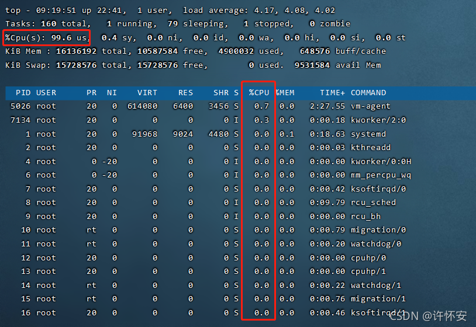
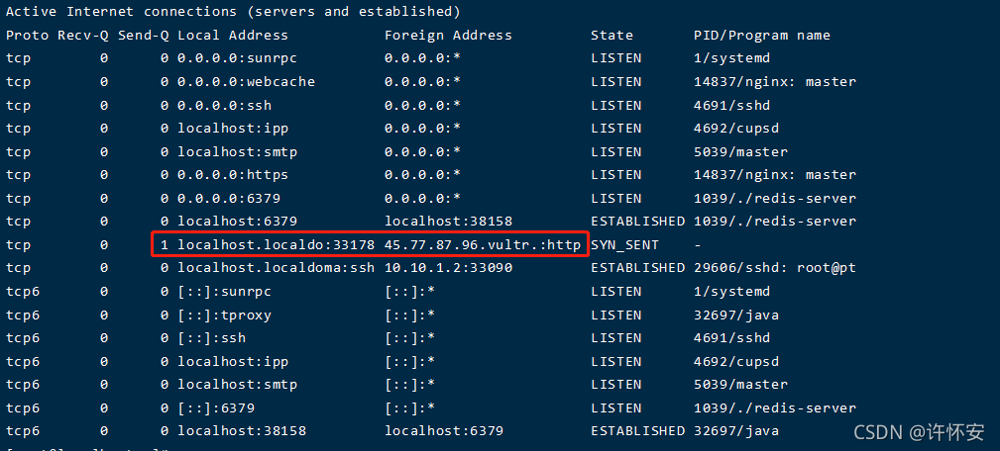
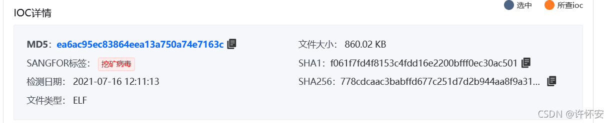
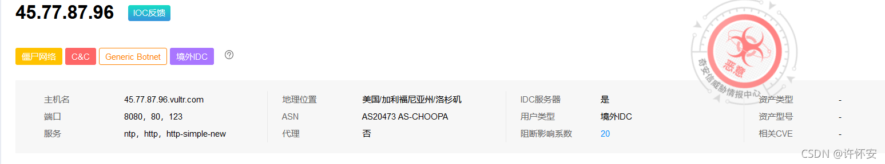
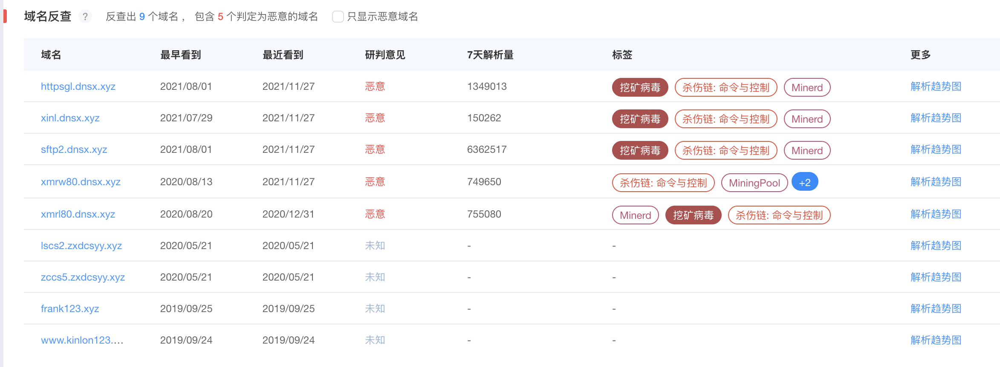

# Linux 挖矿病毒排查与处理

[[toc]]

挖矿病毒是在计算机上恶意进行加密货币挖掘的恶意程序，通常会导致系统性能显著下降、资源浪费，以及潜在的安全风险。本文记录了在 **CentOS 7.6** 环境下的一次挖矿病毒排查与处理过程，并总结了常见的挖矿病毒特征及应对思路。

## 1. 环境信息
```bash
CentOS Linux release 7.6.1810 (AltArch)
Linux 3.10.0-1062.18.1.el7.aarch64 #1 SMP Mon Oct 14 20:23:51 UTC 2019 x86_64 x86_64 x86_64 GNU/Linux
```

## 2. 事件背景
+ **CPU 占用异常高**  
日常巡检时发现，生产服务器 CPU 占用率过高，但查看进程时并没有明显的高占用进程（最高仅 1.x）。系统还频繁收到 `root` 用户发来的系统邮件。  
这引起了挖矿病毒的怀疑。

+ **可疑网络连接**  
通过 `netstat -napt` 命令检查网络连接，发现了一条可疑的国外 IP 地址，查询后确认是一个已知矿池地址。


由此可以推断服务器很可能已经感染挖矿病毒，需要进行深入排查与清理。


## 3. 处理过程
### 3.1 定位根源
1. **检查 **`root`** 用户发送的邮件内容**  
里面记录了一个文件路径 `/etc/ld.so.preload`。

```bash
cat /etc/ld.so.preload
```

结果发现里面指向 `/usr/local/lib/libprocesshider.so`。这是一个 **动态链接库**，被写入 `ld.so.preload` 后，系统在运行程序时会自动加载它，从而隐藏恶意进程。

2. **尝试删除**`/etc/ld.so.preload`

```plain
rm /etc/ld.so.preload
```

结果提示无法删除，说明文件被加锁（只读或不可变属性）。

3. **解锁并删除**  
Linux 有一个 `chattr` 命令可以给文件设置不可修改属性。

:::tip chattr用法
chattr [ -RV ] [ -v version ] [ mode ] files…

最关键的是在[mode]部分，[mode]部分是由+-=和[ASacDdIijsTtu]这些字符组合的，这部分是用来控制文件的

属性。

+ ：在原有参数设定基础上，追加参数。

- ：在原有参数设定基础上，移除参数。

= ：更新为指定参数设定。

A：文件或目录的 atime (access time)不可被修改(modified), 可以有效预防例如手提电脑磁盘I/O错误的发生。

S：硬盘I/O同步选项，功能类似sync。

a：即append，设定该参数后，只能向文件中添加数据，而不能删除，多用于服务器日志文 件安全，只有root才能设定这个属性。

c：即compresse，设定文件是否经压缩后再存储。读取时需要经过自动解压操作。

d：即no dump，设定文件不能成为dump程序的备份目标。

i：设定文件不能被删除、改名、设定链接关系，同时不能写入或新增内容。i参数对于文件 系统的安全设置有很大帮助。

j：即journal，设定此参数使得当通过 mount参数：data=ordered 或者 data=writeback 挂 载的文件系统，
文件在写入时会先被记录(在journal中)。如果filesystem被设定参数为 data=journal，则该参数自动失效。

s：保密性地删除文件或目录，即硬盘空间被全部收回。

u：与s相反，当设定为u时，数据内容其实还存在磁盘中，可以用于undeletion.

各参数选项中常用到的是a和i。
a选项强制只可添加不可删除，多用于日志系统的安全设定。
而i是更为严格的安全设定，只有superuser (root) 或具有CAP_LINUX_IMMUTABLE处理能力（标识）的进程能够施加该选项。

锁定文件：chattr +i 文件名

解除锁定：chattr -i 文件名

属性查看：lsattr 文件名

如果在执行lsattr或是chattr命令时提示不存在，安装一下即可

yum install -y e2fsprogs
:::

    - 查看锁定属性

```bash
lsattr /etc/ld.so.preload
```

    - 解锁并删除

```bash
chattr -i /etc/ld.so.preload
rm -rf /etc/ld.so.preload
```

4. **同理删除**`libprocesshider.so`

```bash
chattr -i /usr/local/lib/libprocesshider.so
rm -rf /usr/local/lib/libprocesshider.so
```

### 3.2 检查和清理定时任务
1. **查看可疑的定时任务文件**
    - 例如 `/etc/cron.d/phps`、`/sbin/httpss` 等

```bash
chattr -i /etc/cron.d/phps
rm -rf /etc/cron.d/phps
chattr -i /sbin/httpss
rm -rf /sbin/httpss
```

2. **查看**`/etc/crontab`

```bash
chattr -i /etc/crontab
vim /etc/crontab
```

删掉可疑的最后几行病毒链接。

3. **查看用户级别的**`crontab`

```bash
crontab -l
crontab -e
```

若编辑时出现“error renaming ... 不允许操作”，则说明对应文件也被加锁，需要解锁后再删除或修复：

```bash
chattr -i /var/spool/cron/root
rm -rf /var/spool/cron/root
chattr -i /tmp/crontab.IFed5j
rm -rf /tmp/crontab.IFed5j
```

如有其它临时文件同样处理。

### 3.3 清理可疑服务和自启动项
1. **检查**`/lib/systemd/system/`**目录**
    - 发现异常服务文件 `pwnriglhttps.service`

```bash
systemctl stop pwnriglhttps.service
systemctl disable pwnriglhttps.service
rm -rf /lib/systemd/system/pwnriglhttps.service
```

2. **检查**`/etc/rc.d/init.d/`**、**`/etc/rc.d/rc.local`**文件**
    - 若无异常则跳过，否则同样解锁并删除。
3. **查看**`/etc/hosts`**文件**  
确认没有被修改成可疑的域名解析。

### 3.4 删除可疑文件
+ 常见位置：`/usr/bin/.sh`, `/bin/.sh`, `/bin/.funzip`，以及 `/etc/.sh` 等隐藏文件。

```bash
chattr -i /usr/bin/.sh
rm -rf /usr/bin/.sh

chattr -i /bin/.funzip
rm -rf /bin/.funzip
```

+ 查看 `/etc/profile` 文件、`/etc/profile.d/` 目录
    - 如果末尾多了可疑的 shell 脚本，如 `php.sh`, `supervisor.sh` 等，则删除相应文件和对应的隐藏目录（如 `/etc/.supervisor/supervisord.conf`）。

```bash
chattr -i /etc/profile.d/php.sh
rm -rf /etc/profile.d/php.sh
```

### 3.5 重启并验证
1. **清除系统邮件**（可选）

```bash
echo "d *" | mail -N
```

2. **重启系统**

```bash
reboot
```

3. **查看网络连接**  
开机后查看网络连接信息发现刚开始的那条IP已经没有了，说明残留的病毒文件已经清理完成

为了再次防止这个矿池来搞事情，最好在出口区域的安全设备的对该地址及域名相关进行封禁，同时上报上级管理部门

### 3.6 进一步防护
+ **在安全设备（防火墙、出口路由）处屏蔽该矿池 IP 或域名**，避免后续同源攻击。
+ 建议**修补系统漏洞**，更新软件或加强权限设置，以免再次中招。


## 4. 常见挖矿病毒特征与对策
1. **高 CPU 占用率**  
病毒会疯狂调用 CPU 进行挖矿。
2. **异常网络连接**  
与矿池服务器保持通信，可能使用国外 IP。
3. **恶意进程或文件隐藏**  
常用 `libprocesshider.so` 等方式在进程列表中伪装或隐藏。
4. **篡改定时任务**  
重启后或定时执行挖矿脚本，确保持续挖矿。
5. **锁定关键系统文件**  
使用 `chattr +i` 等方式防止被移除。
6. **自启动脚本或服务**  
在 `/etc/rc.local`、systemd、init 脚本等处添加恶意服务。

**应对要点**：

+ 勤于巡检CPU、网络、进程、日志；
+ 及时锁定并删除可疑文件；
+ 清理定时任务和自启动项；
+ 修复漏洞并加固服务器安全；
+ 在出口路由封禁已知矿池地址。


## 5. 小结
本次 Linux 挖矿病毒排查主要涉及以下步骤：

1. **发现异常**：CPU 占用过高 & 可疑网络连接。
2. **清理根源**：删除 `ld.so.preload` 等隐藏链接库。
3. **检查定时任务**：移除恶意 cron 脚本。
4. **排查自启动脚本和服务**：删除可疑 systemd 服务、rc.local 插入点。
5. **删除可疑文件**：通常以隐藏文件形式存在，如 `.sh`、`.funzip` 等。
6. **重启并验证**：确认矿池连接消失。
7. **加强防护**：屏蔽矿池 IP，修补系统漏洞，避免再次感染。

通过以上步骤，基本可以彻底排查挖矿病毒并恢复系统的正常运行。

## 6. 后续
**Sangfor 安服中心查询**



**QiAnXin 安服中心查询**



## 6.1 研判分析
网络安全威胁情报分析师判定`45.77.87.96`为**恶意**，该IP被判定为恶意的参考信息如下：

**情报分析**
- 该IP关联1个IOCs(Indicators of compromise), IOC为`45.77.87.96:8081`，风险等级为`high`，恶意家族为`Generic Trojan`，恶意类型为`远控木马`，影响平台为`Windows,Linux`。

**IP画像分析**
- 该IP存在恶意活动记录，包括远控木马活动事件等等;恶意活动的时间在2020-09-03，危害程度高，置信度为中等。

**基础信息分析**
- 该IP的AS号码（自治系统号码）为`20473`, AS组织（自治系统组织）为`AS-CHOOPA`, 归属组织为`Vultr Holdings, LLC`, IP使用场景为`已使用`，地理位置在`美国加利福尼亚州洛杉矶`。

**标签分析**
- 该IP所关联到多个标签，比如"Generic Trojan"恶意家族标签、"远控木马"恶意类型标签、"C&C" kill_chain 标签等等。这表明该IP历史上被不少安全厂商或者情报社区等标记了恶意活动。

**IP Whois分析**
- IP whois信息显示该IP的RIR（Regional Internet Registry）即区域性互联网注册处为"arin"，代表美国网络信息中心（American Registry for Internet Numbers）。网络名称为"CONSTANT"，更新于"2017-07-10 00:00:00"。

**解析情况分析**
- 最近解析到该IP的域名为`xmrw80.dnsx.xyz`和`xmrl80.dnsx.xyz`，这两个域名最近一次解析到该IP的时间分别为`2021-01-01 23:50:01`和`2020-12-30 23:49:45`，域名状态为恶意。

**结论综述**
- 该IP被判定为恶意的参考信息如下：
  - 恶意家族：Generic Trojan
  - 恶意类型：远控木马
  - 风险等级：high
  - 恶意活动记录：远控木马活动事件
  - 危害程度：高
  - 置信度：中等

### 域名反查


> [!TIP]
> - 国内安服厂商很早已发现这个病毒，针对群体基本为政府部门，中小型企，经与几位在安服中心工作的朋友沟通，发现这个病毒的变种很多，且有些是针对特定行业的，建议大家在日常巡检中多加注意。<br>
> - 攻击手法基本为扫描开放到互联网的SSH端口，爆破密码，获取root权限后进行挖矿，建议大家在日常巡检中多加注意。<br>
> - 另外，建议大家在日常巡检中多加注意，定期检查系统邮件、网络连接、进程列表等，及时发现异常情况并进行处理。<br>

**作者**：许怀安  
**创作时间**：2021-11-05  
**版权声明**：本博客所有文章除特别声明外，均采用 [BY-NC-SA](https://creativecommons.org/licenses/by-nc-sa/4.0/deed.zh) 许可协议。转载请注明出处。
