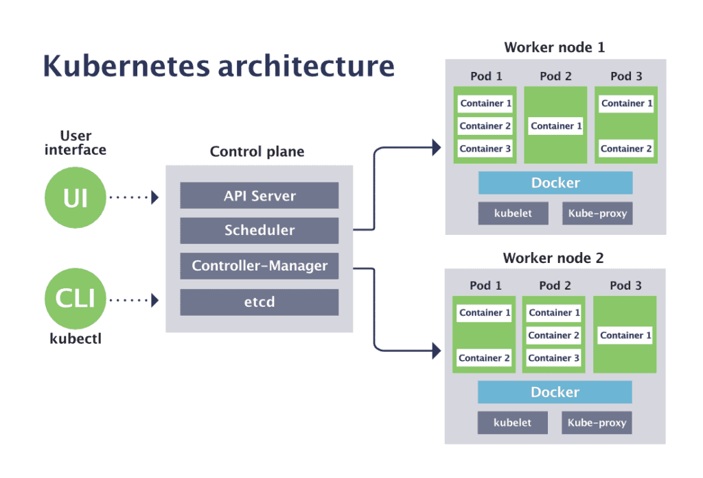

# 控制平面组件
## etcd
etcd 是一个快速、分布式、一致的键值存储，用作持久存储 Kubernetes 对象数据（如 pod、replication controllers, secrets, services 等）的后备存储。实际上，etcd 是 Kubernetes 存储集群状态和元数据的唯一地方。唯一直接与 etcd 对话的组件是 Kubernetes API Server。所有其他组件通过 API Server 间接读取和写入数据到 etcd。

Etcd 还实现了一个监视功能，它提供了一个基于事件的接口，用于异步监控键的更改。一旦密钥被更改，它的观察者就会收到通知。API Server 组件在很大程度上依赖于此来获得通知并将 etcd 的当前状态移动到所需状态。

**etcd 实例的数量应该是奇数吗？**

在 HA 环境中，您通常会运行 3、5 或 7 个 etcd 实例，但为什么呢？由于 etcd 是分布式数据存储，因此可以水平扩展它，但您还需要确保每个实例中的数据是一致的，为此，您的系统需要就状态达成共识。Etcd 为此使用了RAFT **共识算法[1]**。

该算法需要多数（或仲裁）集群才能进入下一个状态。如果您只有 2 个 ectd 实例，如果其中任何一个失败，则 etcd 集群无法转换到新状态，因为不存在多数，并且在 3 个实例的情况下，一个实例可能会失败并且可以达到多数的实例仍然可用。

## API Server
API Server 是 Kubernetes 中唯一与 etcd 直接交互的组件。Kubernetes 以及客户端（kubectl）中的所有其他组件都必须通过 API Server 来处理集群状态。API Server 提供以下功能：

 * 提供在 etcd 中存储对象的一致方式。
 * 执行这些对象的验证，以便客户端无法存储配置不正确的对象，如果它们直接写入 etcd 数据存储区可能会发生这种情况。
 * 提供 RESTful API 来创建、更新、修改或删除资源。
 * 提供乐观并发锁定，因此在并发更新的情况下，对对象的更改永远不会被其他客户端覆盖。
 * 对客户端发送的请求执行身份验证和授权。它使用插件提取客户端的用户名、用户 ID 和用户所属的组，并确定经过身份验证的用户是否可以对请求的资源执行请求的操作。
 * 如果请求试图创建、修改或删除资源，则执行**准入控制[2]**。示例：AlwaysPullImages、DefaultStorageClass、ResourceQuota 等。
 * 为客户端实现监视机制（类似于 etcd）以监视更改。这允许调度程序和 Controller Manager 等组件以松散耦合的方式与 API Server 交互。

## Controller Manager
在 Kubernetes 中，控制器是监控集群状态的控制循环，然后根据需要进行更改或请求更改。每个控制器都尝试将当前集群状态移动到更接近所需状态。控制器跟踪至少一种 Kubernetes 资源类型，并且这些对象有一个表示所需状态的规范字段。

控制器示例：

 * Replication Manager（ReplicationController 资源的控制器）
 * ReplicaSet、DaemonSet 和 Job 控制器
 * Deployment 控制器
 * StatefulSet 控制器
 * Node 控制器
 * Service 控制器
 * Endpoints 控制器
 * Namespace 控制器
 * PersistentVolume 控制器
控制器使用监视机制来获得更改通知。他们监视 API Server 对资源的更改并针对每个更改执行操作，无论是创建新对象还是更新或删除现有对象。大多数时候，这些操作包括创建其他资源或自己更新被监视的资源，但是由于使用监视并不能保证控制器不会错过任何事件，它们还会定期执行重新列出操作以确保没有错过了任何东西。

Controller Manager 还执行生命周期功能，例如命名空间创建和生命周期、事件垃圾回收、终止 pod 垃圾回收、**级联删除垃圾回收[3]**、节点垃圾回收等。

## Scheduler
调度程序是一个控制平面进程，它将 pod 分配给节点。它监视没有分配节点的新创建的 pod，并且对于调度程序发现的每个 pod，调度程序负责为该 pod 找到运行的最佳节点。

满足 Pod 调度要求的节点称为可行节点。如果没有合适的节点，则 pod 将保持未调度状态，直到调度程序能够放置它。一旦找到可行节点，它就会运行一组函数来对节点进行评分，并选择得分最高的节点。然后它会通知 API Server 有关所选节点的信息，此过程称为绑定。

节点的选择分为两步：

1. **过滤**所有节点的列表以获取 pod 可以调度到的可接受节点列表。（例如，PodFitsResources 过滤器检查候选节点是否有足够的可用资源来满足 Pod 的特定资源请求）

2. **对从第 1 步获得的节点列表进行评分**并对它们进行排名以选择最佳节点。如果多个节点得分最高，则使用循环法确保 pod 均匀地部署在所有节点上。
调度决策需要考虑的因素包括：

 * Pod 对硬件/软件资源的请求？节点是否报告内存或磁盘压力情况？
 * 该节点是否具有与 pod 规范中的节点选择器匹配的标签？
 * 如果 pod 请求绑定到特定的主机端口，该端口是否已在该节点上占用？
 * pod 是否容忍节点的污点？
 * pod 是否指定节点亲和性或反亲和性规则？等。
调度程序不会指示所选节点运行 pod。Scheduler 所做的只是通过 API Server 更新 pod 定义。API server 通过 watch 机制通知 Kubelet pod 已经被调度。然后目标节点上的 kubelet 服务看到 pod 已被调度到它的节点，它创建并运行 pod 的容器。

# 工作节点组件
## Kubelet
Kubelet 是在集群中的每个节点上运行的代理，是负责在工作节点上运行的所有内容的组件。它确保容器在 Pod 中运行。

kubelet 服务的主要功能有：

1. 通过在 API Server 中创建节点资源来注册它正在运行的节点。
2. 持续监控 API Server 上已调度到节点的 Pod。
3. 使用配置的容器运行时启动 pod 的容器。
4. 持续监控正在运行的容器并将其状态、事件和资源消耗报告给 API Server。
5. 运行容器活性探测，在探测失败时重新启动容器，在容器的 Pod 从 API Server 中删除时终止容器，并通知服务器 Pod 已终止。

## kube-proxy
它在每个节点上运行，并确保一个 pod 可以与另一个 pod 对话，一个节点可以与另一个节点对话，一个容器可以与另一个容器通信等。它负责监视 API Server 以了解Service和 pod 定义的更改，以保持整个网络配置的最新状态。当一个Service由多个 pod 时，proxy会在这些 pod 之间负载平衡。

kube-proxy 之所以得名，是因为它是一个实际的代理服务器，用于接受连接并将它们代理到 Pod，当前的实现使用 iptables 或 ipvs 规则将数据包重定向到随机选择的后端 Pod，而不通过实际的代理服务器传递它们。

1. 创建服务时，会立即分配一个虚拟 IP 地址。
2. API Server 通知在工作节点上运行的 kube-proxy 代理已经创建了新服务。
3. 每个 kube-proxy 通过设置 iptables 规则使服务可寻址，确保拦截每个服务 IP/端口对，并将目标地址修改为支持服务的 pod 之一。
4. 监视 API Server 对服务或其端点对象的更改。

# 容器运行时
专注于运行容器、设置命名空间和容器的 cgroup 的容器运行时称为低级容器运行时，专注于格式、解包、管理和共享images并提供 API 以满足开发人员需求的容器运行时称为高级容器运行时（容器引擎）。

容器运行时负责：

1. 如果本地不可用，则从镜像注册表中拉取容器所需的容器镜像。
2. 将镜像提取到写入时复制文件系统，所有容器层相互重叠以创建合并文件系统。
3. 准备容器挂载点
4. 从容器镜像设置元数据，例如覆盖 CMD、来自用户输入的 ENTRYPOINT、设置 SECCOMP 规则等，以确保容器按预期运行。
5. 更改内核以向该容器分配某种隔离，例如进程、网络和文件系统。
6. 提醒内核分配一些资源限制，如 CPU 或内存限制。
7. 将系统调用（syscall）传递给内核以启动容器。
8. 确保 SElinux/AppArmor 设置正确。

### 参考资料
[[1] RAFT 共识算法](https://www.geeksforgeeks.org/raft-consensus-algorithm/)
 [[2] 准入控制](https://kubernetes.io/docs/reference/access-authn-authz/admission-controllers/)
 [[3] 级联删除垃圾回收](https://kubernetes.io/docs/concepts/architecture/garbage-collection)

>本文作者：[许怀安](https://dbsecurity.com.cn/)
> 创作时间：2022.06.16
> 版权声明：本博客所有文章除特别声明外，均采用[BY-NC-SA](https://creativecommons.org/licenses/by-nc-sa/4.0/deed.zh)许可协议。转载请禀明出处！
